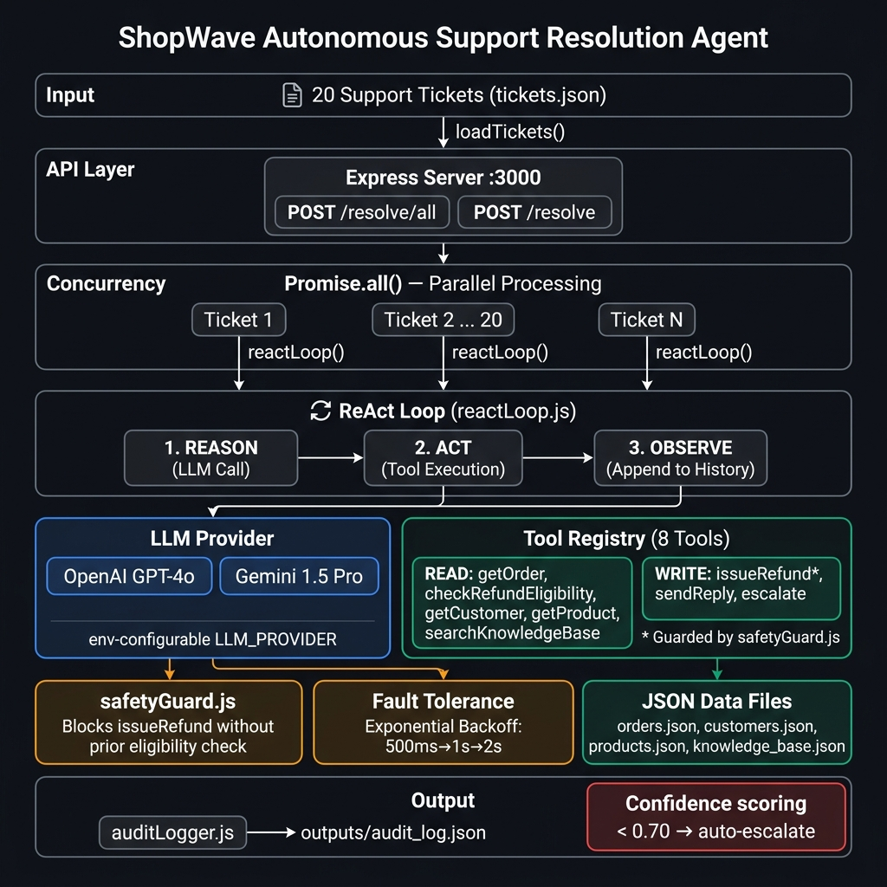

# ShopWave Autonomous Support Resolution Agent

A production-grade AI support agent built for the Agentic AI Hackathon 2026. This agent autonomously resolves customer support tickets using a custom ReAct (Reason → Act → Observe) loop, complete with realistic tool failure simulations, fault tolerance, and a programmatic safety guard.



## Features

- **Custom ReAct Loop**: No heavy frameworks (LangChain/LangGraph). Pure Node.js loop with reasoned tool execution.
- **Fault Tolerance**: Exponential backoff (500ms → 1000ms → 2000ms) for failed tool calls mapping to realistic network issues.
- **Safety Guard**: Programmatically enforces that `issueRefund()` cannot be executed unless `checkRefundEligibility()` was called first. Cannot be overridden by the LLM.
- **Parallel Processing**: Uses `Promise.all()` to process all 20 tickets concurrently. Per-ticket error boundaries ensure one failure never stops the others.
- **Dual LLM Support**: Supports both OpenAI (`gpt-4o`) and Google Gemini (`gemini-1.5-pro`) via `.env` toggle.
- **Comprehensive Audit Logging**: Structured JSON logging for every ticket, tracking the exact tool call sequence, duration, retries, and reasoning trace.

## Project Structure

```text
shopwave-agent/
├── src/
│   ├── index.js            # Express server & concurrency engine
│   ├── agent/
│   │   ├── reactLoop.js    # Core Reason → Act → Observe loop
│   │   ├── tools.js        # 8 simulated async tools with failures
│   │   ├── safetyGuard.js  # Refund block and hard enforcements
│   │   └── prompts.js      # System instruction and JSON parser
│   ├── data/               # Mock data (tickets, orders, etc.)
│   └── logger/
│       └── auditLogger.js  # Audit log writer
├── outputs/
│   └── audit_log.json      # Structured agent execution logs
├── failure_modes.md        # Documentation of edge cases
├── architecture.png        # System design
└── .env.example            # Secrets template
```

## Setup & Single Run Command

1. **Install dependencies**:
   ```bash
   npm install
   ```

2. **Configure Environment Variables**:
   Copy `.env.example` to `.env` and configure your API key.
   ```bash
   cp .env.example .env
   ```
   *Edit `.env` and set `LLM_PROVIDER=openai` (or `gemini`) and provide the corresponding API key.*

3. **Start the Server & Run the Agent (Single Command)**:
   ```bash
   npm start
   ```
   This will start the Express server on port 3000.

4. **Trigger Concurrent Resolution**:
   Open a new terminal and run:
   ```bash
   curl -X POST http://localhost:3000/resolve/all
   ```
   This will immediately process all 20 tickets in parallel.

5. **View Results**:
   Once complete, check `outputs/audit_log.json` for the comprehensive execution log.

## Tool Overview

The agent has access to 8 tools simulating a real e-commerce backend:
1. `getOrder` - Read order data (20% timeout failure rate)
2. `checkRefundEligibility` - Verify return window & status (15% malformed JSON failure rate)
3. `getCustomer` - Fetch user tier (10% partial data failure rate)
4. `getProduct` - Fetch return policy details (5% null response rate)
5. `searchKnowledgeBase` - Pull policy rules
6. `issueRefund` - WRITE (Protected by safety guard)
7. `sendReply` - WRITE
8. `escalate` - Route to human agent
